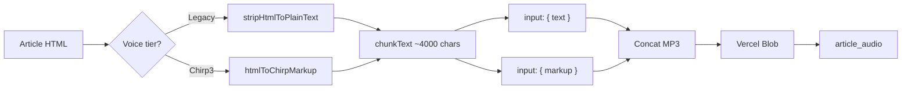

# Chirp 3 HD TTS integration

Planning document for Google Chirp 3 HD narration in read-it-later.

## Rationale

- **Quality**: Chirp 3 HD is tuned for natural, conversational narration with pause control.
- **Cost**: ~$30/M characters vs Studio ~$160/M; GCP includes ~1M free Chirp chars/month per project.
- **Pauses**: Markup tags (`[pause]`, `[pause long]`) at HTML structure boundaries improve listenability vs flat plain text.

Legacy tiers (Standard, WaveNet, Neural2, Studio) remain available unchanged.

## API contract

| Voice tier | `SynthesisInput` field | Content prep |
|------------|------------------------|--------------|
| Chirp 3 HD | `markup` | `htmlToChirpMarkup()` |
| All others | `text` | `stripHtmlToPlainText()` |

Reference: [Chirp 3 HD voices](https://cloud.google.com/text-to-speech/docs/chirp3-hd)

**Critical**: Chirp voices must never receive markup in the `text` field — pause tags are ignored.

## Markup rules (canonical)

| Element | Tag appended |
|---------|----------------|
| `p`, `blockquote` | ` [pause long]` |
| `h1`–`h6`, `li`, `br` | ` [pause]` |
| `script`, `style`, `noscript` | removed |
| bare `div` | no pause (children processed) |

Implementation: `src/server/services/tts-markup.ts`

## Voice naming

Format: `{lang}-{region}-Chirp3-HD-{Name}` — e.g. `en-US-Chirp3-HD-Charon`.

Curated list in `src/lib/tts-voices.ts`.

## Quota multiplier

Chirp 3 HD uses **8×** standard-equivalent quota ($30/M vs $4/M standard-equivalent cap).

```text
weightedChars = rawChars × 8
```

Shared monthly cap: 4M standard-equivalent characters (`TTS_FREE_TIER_LIMIT`).

## Defaults

- `DEFAULT_VOICE` = `en-US-Chirp3-HD-Charon`
- Existing `user_preferences.ttsVoiceName` rows are not migrated.

## Architecture



## Out of scope

- Gemini TTS
- `synthesizeLongAudio` (GCS LRO for very long articles)
- Streaming synthesis
- Instant custom voice
- Dynamic voice list from GCP API

## Manual QA checklist

- [ ] Short article with Chirp default — hear paragraph pauses
- [ ] Long article — generation completes, playback OK
- [ ] Switch Studio → Chirp — regenerate — new voice + pauses
- [ ] Usage meter reflects 8× after Chirp generation
- [ ] Legacy Neural2 article still works with `text` path

## Files

| File | Role |
|------|------|
| `src/lib/tts-voices.ts` | Tiers, voices, multipliers, `isChirp3Voice` |
| `src/server/services/tts-markup.ts` | HTML → markup |
| `src/server/services/tts.ts` | Synthesis + chunking |
| `src/server/api/routers/tts.ts` | tRPC + usage billing |
| `src/app/_components/voice-selector.tsx` | Voice picker UI |
